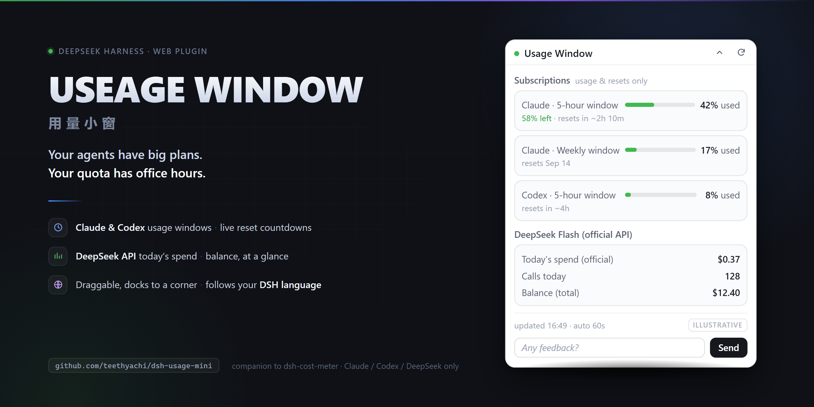

[English](README.md) | 简体中文

# 用量小窗（USEAGE WINDOW）

[](https://www.npmjs.com/package/dsh-usage-mini) [](LICENSE) [](https://github.com/deepseek-ai/deepseek-harness) [](https://huggingface.co/spaces/BruceWuu/useage-window) [](https://dsh-plugin.org/plugins/teethyachi/dsh-usage-mini)



**Agent 的野心是无限的，你的额度是有班次的。**

它是 [`dsh-cost-meter`](https://github.com/Han-1413141/dsh-cost-meter) 和 `dsh-plugin-subscriptions` 的搭档小窗：数据由它们去取，这个窗口只负责让数字一直待在你眼皮底下。

一个给 **DeepSeek Harness Web** 用的悬浮用量面板。想看一眼额度，不用再在一堆标签页里翻找。

> **目前只支持 Claude 订阅、Codex（ChatGPT）订阅和 DeepSeek API。** 不是通用账单面板，也不是 Anthropic / OpenAI / DeepSeek 的官方产品。

## 它能给你什么

- **Claude + Codex 订阅**：可用的用量窗口、已用/剩余百分比、重置时间与倒计时。订阅就是订阅，不会给你编一个"余额"出来。
- **DeepSeek API**：本地账本里记录的今日官方消耗与调用次数，以及上游缓存的官方账户余额。有 Flash 明细时一并显示。
- **跟随 DSH 的语言设置**。小窗读取宿主的 `<html lang>`，中文界面还是英文界面由它决定，你在「设置 → 语言」里一切，它立刻跟着切。它自己不提供语言开关——你已经有一个了。
- 想放哪儿就拖到哪儿，不看的时候收进最近的屏幕角落。位置记在这个浏览器里。
- 设置里有显示开关，可以手动刷新；展开且页面可见时每 60 秒轮询一次。收起或隐藏就不轮询了——一个看用量的东西，自己不该再需要一个看用量的东西。
- 窗口底部有**一条反馈栏**。写一句，按「发送」，会打开一个预填好的 GitHub issue。每条都会回复，采纳的会在下一版里带署名上线。见[反馈](#反馈这个小窗是被-issue-推着长大的)。

## 安装

需要已经装好的 DeepSeek Harness Web 和 pnpm。仓库里放的就是可直接加载的 JavaScript，没有构建步骤，也没有安装脚本。和你手上这版 DSH 的兼容性**未经认证**，见[兼容性](#兼容性package.json-里怎么写的)。

从 npm 装（推荐；dsh-extension-hub 这类插件管理器也走这条）：

```sh
dsh plugin --profile web add dsh-usage-mini
```

从 GitHub 最新的 tag 版本装：

```sh
dsh plugin --profile web add github:teethyachi/dsh-usage-mini#v0.2.2
```

或者下载 release 的 tarball：

```sh
dsh plugin --profile web add ./dsh-usage-mini-0.2.2.tgz
```

想钉死到某个具体 commit：

```sh
dsh plugin --profile web add github:teethyachi/dsh-usage-mini#<commit-sha>
```

重启你原有的 Web profile，然后刷新页面。在「设置 → 用量小窗」里控制显示/隐藏。为了兼容，包名仍然是 `dsh-usage-mini`；**USEAGE WINDOW** 是产品名的指定写法。

### 需要的数据来源插件

这是个展示插件，不是账号连接器的替代品。下面这些要在同一个 Web profile 里单独启用：

| 功能 | 需要已有的插件 |
|---|---|
| Claude / Codex 用量 | `dsh-plugin-subscriptions`，并已登录对应订阅 |
| DeepSeek 消耗 / 余额 | `dsh-cost-meter`，并配置好账本与官方余额 |

它们**不会被打包进来，也不会被偷偷安装**。某个接口不可用时，对应那一栏会显示提示，另一栏照常工作。真正决定能否用起来的是这些 RPC 契约，而不是"装了个名字差不多的包"。

## 兼容性（`package.json` 里怎么写的）

| 字段 | 值 | 依据 |
|---|---|---|
| Node.js（`engines.node`） | `22.23.2`（精确版本） | 实际跑过的只有这一个 Node 版本（Windows）。DSH 自己声明的 `^22.19.0 \|\| >=24.0.0` 里的其余版本都没测过，所以不声明。 |
| DSH（`dsh.compatibility.dshReleases`） | `0.1.2-rc.1`：**compatible** · `0.1.1-rc.2`、`0.1.2-alpha.4`、`0.1.2-alpha.5`：**unknown** | `0.1.2-rc.1`：在一次性 `DSH_HOME` 里完整 `dsh --profile web` 启动、客户端经真实 web 模块加载器下发、无头浏览器在 zh-CN 与 en-US 下渲染且零页面错误、干净卸载——见 [docs/store-evidence.md](docs/store-evidence.md)。另外三个只有安装/合成证据（rc.2）或没有证据（alpha），保持 `unknown`。 |
| Profile | 仅 `web` | 纯浏览器端，没有 headless / TUI 行为。 |
| 操作系统 | 只跑过 Windows（`win32`） | 代码里没有任何跟系统相关的东西，但确实只在 Windows 上跑过。 |

**更正（0.1.2，已并入 0.1.3）：** 早先的 manifest 写过 `engines.node >=22.19.0`，还把两个 DSH 版本标成了 `compatible`。那是说过头了：源码层面的兼容和配置合成，都不等于自证的完整运行时兼容。上面这张表才是老实的状态。它也不代表 DSH STORE 已经完成了自己的 Profile 安装或运行时验收——在有真实运行时证据之前，商店条目可能一直是受限或未上架状态。

## 权限、依赖与故障边界

- **生命周期脚本**：没有（`preinstall`/`install`/`postinstall`/`prepare` 一个都没有）。**运行时依赖**：没有；只从 DSH 的 web 模块加载器里取 `react`。
- **网络**：浏览器端只对当前 DSH 源发同源 `fetch` POST，一共四个：`/subscriptions-auth/status`、`/subscriptions-auth/usage`、`/api/costMeter/getState`、`/api/costMeter/refreshBalance`。它自己从不访问外部主机。上游插件（`dsh-plugin-subscriptions`、`dsh-cost-meter`）在响应这些 RPC 时会替你去访问 Anthropic/OpenAI/DeepSeek；强制刷新会触发这类上游请求。
- **文件 / 命令 / 凭据**：都没有。宿主那一半是空实现；插件不读文件、不起进程、不碰任何 token。凭据状态始终留在上游插件里。
- **本地存储**：两个浏览器 `localStorage` 键：`dsh-usage-mini:ui`（窗口位置、收起状态、显示与否）和 `dsh-usage-mini:feedback`（上次发送时间戳、发送次数）。用量数据一条都不落盘。
- **反馈栏**：按「发送」会对 `https://github.com/teethyachi/dsh-usage-mini/issues/new?…` 调 `window.open`。那是你浏览器的一次跳转，不是插件发出的请求；你不在 GitHub 上按 Submit，就什么都没发出去。见[反馈](#反馈这个小窗是被-issue-推着长大的)。
- **屏幕上的数据**：订阅插件返回的账号标识和缓存余额会显示在窗口里。截图前记得打码。
- **缓存语义**：DeepSeek 余额是 cost-meter 的缓存快照。自动轮询只在从未取到过余额时才请求刷新，手动按钮才是强制刷新。刷新失败时，旧快照保留，并附带自己的状态说明。
- **故障边界**：某个 RPC 返回 HTTP 404，只会让那一栏显示「通道不存在」，另一栏继续工作。其他错误在该栏里以文字显示。宿主入口本身什么都不做、客户端错误按栏捕获，所以设计上它不会把宿主拖垮——这是设计陈述，不是跨 DSH 版本验证过的保证。

## 数字要看明白（虽然扫兴）

- 订阅的百分比是上游的用量窗口，不是钱，也不是某次对话的账单。
- 今日 DeepSeek 消耗来自 cost-meter 的账本（`deepseek` / `deepseek-official` 路由）。它**不保证覆盖你账户上的每一笔扣费**。汇率换算走 cost-meter 的设置。
- 余额是缓存快照。手动刷新会请求更新，网络或服务方出问题时可能停在旧快照上。
- 这个小窗**不会**卡预算、不会掐停 Agent、不会替你切模型，也不承诺帮你省钱。

## 隐私与实现

一个空实现的宿主入口，加上一个用 DSH 模块加载器和 `settings.section` 插槽的浏览器客户端。请求只发往当前 DSH 源：`/subscriptions-auth/status`、`/subscriptions-auth/usage`、`/api/costMeter/getState`、`/api/costMeter/refreshBalance`。上游认证由已有的宿主插件处理。这个包不加任何外部统计，也没有任何输入凭据的界面。

浏览器 localStorage 只存显示偏好。账号标识和余额会出现在屏幕上：分享截图前先打码。永远不要公开你的 DSH profile、凭据、账本或会话记录。

## 反馈：这个小窗是被 issue 推着长大的

展开后的窗口底部有一行输入框，问你 **给点儿意见？**（英文界面是 **Any feedback?**）。写完按「发送」，浏览器新标签页里会打开一个**预填好的 GitHub issue**，你在那儿按 Submit 就完事了。

进到那个 URL 里的，只有这些：

| 字段 | 内容 |
|---|---|
| `feedback` | 你写的文字，去掉首尾空白，最多 500 字 |
| `version` | 插件版本号（例如 `0.2.0`） |
| `title` / `labels` / `template` | `[反馈] …`（英文界面是 `[feedback] …`）、`feedback`、`feedback.yml` |

绝不包含：用量百分比、余额、消耗、账号标识、订阅状态、token，以及任何从 DSH RPC 读到的东西。60 秒本地冷却和 500 字上限都在浏览器里执行。如果你的浏览器拦了弹窗，小窗会改成给你一个普通链接。

维护这边的闭环：

1. 每条 `feedback` issue 都会得到回复：采纳，或者不采纳并说明原因。
2. 采纳的在分支上实现、测试，由人工合并。`main` 上没有自动提交。
3. 上线它的那一版，会在 CHANGELOG 里引用对应的 issue 号。
4. 无论多少人投票都不会改的硬边界：只做 Claude / Codex 订阅和 DeepSeek API；不新增网络端点；不碰凭据；不改 DSH 主界面。

不想用小窗提？[直接开 issue](https://github.com/teethyachi/dsh-usage-mini/issues/new?template=feedback.yml)。

## 卸载

```sh
dsh plugin --profile web remove dsh-usage-mini
```

然后重启 Web profile。

## 链接

- Hugging Face Space（项目页 / 镜像）：https://huggingface.co/spaces/BruceWuu/useage-window
- 中文介绍（为什么做这个小窗）：[docs/blog-zh.md](docs/blog-zh.md)

如果它帮你省下了一个标签页，点个 GitHub Star 或者给 Hugging Face Space 点个 Like，能让别的 DSH 用户更容易找到它。当然，报 bug 和提 PR 更有用。

## 发布前的自查

跑 `npm test` 和 `npm pack --dry-run`。自动化检查覆盖打包接线、兼容性 manifest 的形状、反馈 URL 构造和余额刷新的回归；它们不代表在每个服务方、每个浏览器上都做过新鲜的真账号测试，也不代表在任何 DSH 版本上做过运行时验证。发布这件事不会改动本地已安装的那份副本。

MIT 许可。欢迎贡献——尤其欢迎准确的失败状态，而不是看起来很自信的一堆零。
